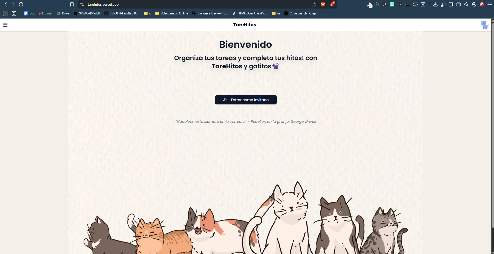
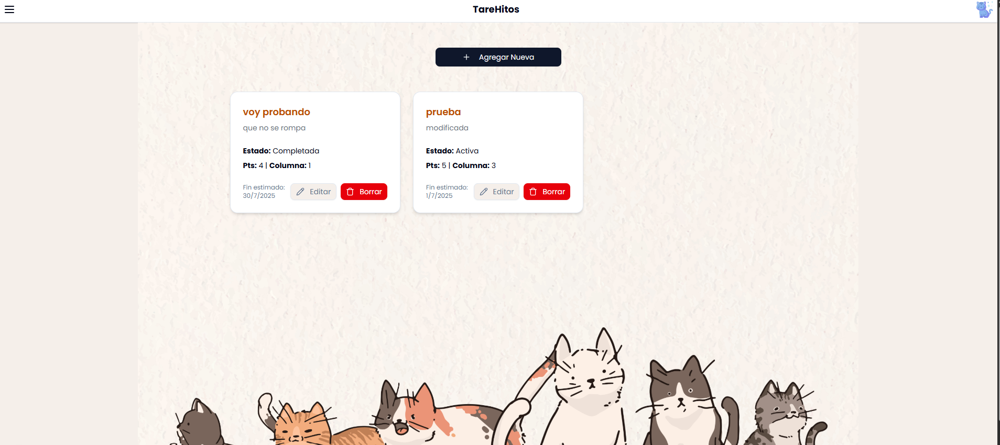
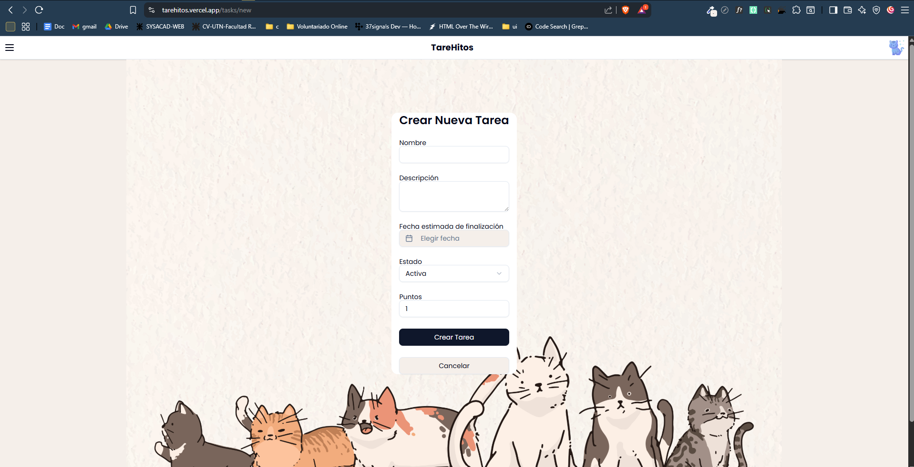
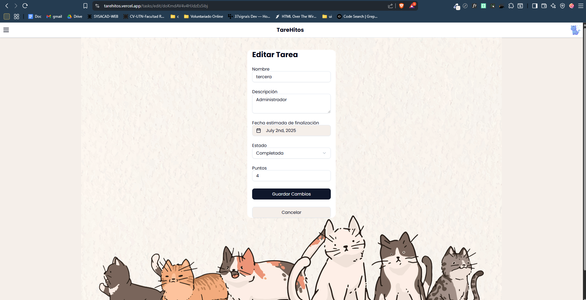

# 🧠 TareHitos
[VISITAR](https://tarehitos.vercel.app/)

**TareHitos** es una aplicación web desarrollada como parte del proceso de ingreso a la **Academia ForIT**. Su propósito es ofrecer una experiencia clara y eficiente para la **gestión de tareas personales**, con una interfaz moderna y adaptable.

---

## 🛠️ Tecnologías utilizadas

| Tecnología     | Versión    |
|----------------|------------|
| Next.js        | 15.4.4     |
| React          | 19.1.0     |
| TailwindCSS    | ^4         |
| shadcn/ui      | (Radix UI, clsx, cva...) |
| Firebase       | ^12.0.0    |
| Date-fns       | ^4.1.0     |
| Lucide React   | ^0.534.0   |
| TypeScript     | ^5         |

---

## 🖼️ Funcionalidades principales

### 🏠 Pantalla de inicio

Al ingresar al sitio se presenta una bienvenida con opciones para autenticarse o ingresar como invitado.



---

### 📋 Pantalla de tareas

Al hacer clic en el botón **“Mis Tareas”** o desde el menú lateral, se accede al panel de tareas del usuario:


---

### 🧠 Gestión de tareas

- Crear una nueva tarea con el botón **Agregar Nueva**.
- Editar o eliminar una tarea con los botones correspondientes.



---

### ➕ Crear nueva tarea

Completar campos como:
- Nombre
- Descripción
- Estado
- Dificultad (puntos)
- Fecha estimada de finalización



---

### ✏️ Modificar tarea

El formulario se completa automáticamente para que puedas modificar la tarea y guardar o cancelar los cambios.



---

## 🙋 Acerca de mí

En la pantalla **Acerca de mí** encontrarás una breve presentación sobre el propósito de la app y sobre mí:

> Soy **Emerson Matijasevic**. Esta aplicación llamada **TareHitos** fue desarrollada como parte del challenge de ingreso a la **Academia ForIT**.
>  
> Es la **primera vez que uso Next.js**, y lo hice con muchas ganas de aprender algo nuevo.  
>  
> Estoy muy emocionado por esta oportunidad y ¡me encantaría que me acepten!  
>  
> Quiero seguir creciendo, aprender nuevas tecnologías y conseguir un trabajo como desarrollador.

---

## 🚀 ¿Cómo levantar el proyecto localmente?

1. **Clonar el repositorio:**

   ```bash
   git clone https://github.com/tu-usuario/tarehitos.git
   cd tarehitos

2. **Instalar dependencias**
    npm install

3. **Crear archivo de variables de entorno**

Crea un archivo .env.local en la raíz con el siguiente contenido:
    NEXT_PUBLIC_FIREBASE_API_KEY=TU_API_KEY
    NEXT_PUBLIC_FIREBASE_AUTH_DOMAIN=taskban-v1.firebaseapp.com
    NEXT_PUBLIC_FIREBASE_PROJECT_ID=taskban-v1
    NEXT_PUBLIC_FIREBASE_STORAGE_BUCKET=taskban-v1.appspot.com
    NEXT_PUBLIC_FIREBASE_MESSAGING_SENDER_ID=774075443466
    NEXT_PUBLIC_FIREBASE_APP_ID=1:774075443466:web:c719b046eec7b2838872f3
    NEXT_PUBLIC_FIREBASE_MEASUREMENT_ID=G-2G0T50SSBE

4. **Iniciar el servidor local**
    npm run dev

5. **Abrir la aplicación**

Accedé a http://localhost:3000

---

## 🔮 Próximos pasos
Gestión de tableros

Administración de equipos

Sistema completo de usuarios con roles

Autenticación con más opciones y filtros avanzados

---

## Gracias por visitar TareHitos 🧠✨
¡Espero que disfrutes usándola tanto como yo disfruté desarrollarla!